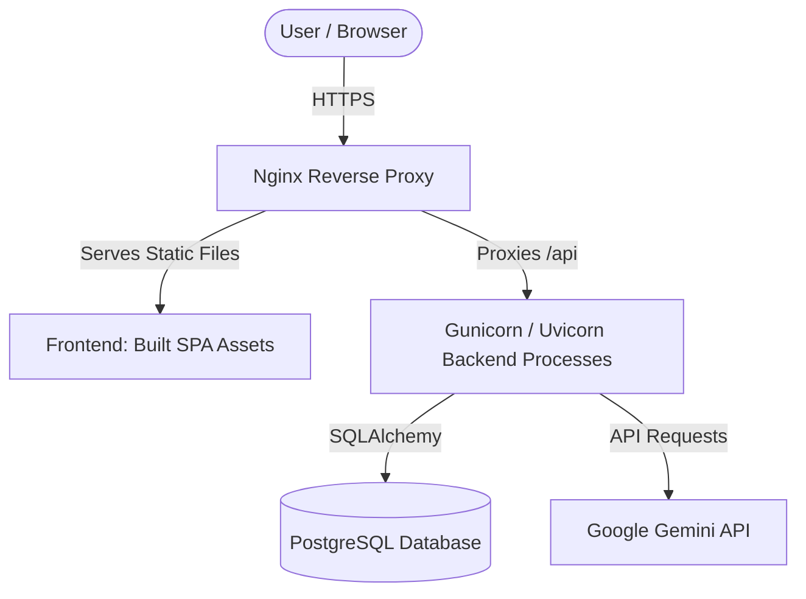

# Production Deployment Guide

This document describes how to deploy the **AI Project Interview Generator** in a production environment.

---

## 🏗️ Production Architecture



---

## 1. Database Setup (PostgreSQL)

For production, you should transition from SQLite to a dedicated PostgreSQL database.

1. **Spin up a PostgreSQL instance** (e.g. AWS RDS, Render PostgreSQL, Supabase).
2. **Update the backend configuration** via environment variables:
   ```env
   DATABASE_URL=postgresql://db_user:db_password@db_host:5432/db_name
   ```
   FastAPI automatically uses PostgreSQL drivers when the URI starts with `postgresql`.

---

## 2. Docker Configuration

We recommend running the backend in containers. Here is a sample `Dockerfile` for the backend.

### Backend Dockerfile (`backend/Dockerfile`)
```dockerfile
FROM python:3.11-slim

WORKDIR /app

# Install system dependencies needed for compiling psycopg2
RUN apt-get update && apt-get install -y \
    build-essential \
    libpq-dev \
    && rm -rf /var/lib/apt/lists/*

COPY requirements.txt .
RUN pip install --no-cache-dir -r requirements.txt

COPY . .

EXPOSE 8000

CMD ["uvicorn", "app.main:app", "--host", "0.0.0.0", "--port", "8000"]
```

---

## 3. Frontend Production Build

1. **Configure API Endpoint**:
   Ensure `API_URL` in `frontend/src/context/AuthContext.jsx` points to your production API domain:
   ```javascript
   export const API_URL = import.meta.env.VITE_API_URL || "https://api.yourdomain.com";
   ```

2. **Run production compile**:
   ```bash
   cd frontend
   npm run build
   ```
   This generates highly optimized static assets inside the `frontend/dist` directory.

---

## 4. Serving with Nginx

Install and configure Nginx to serve static files and proxy API calls.

### Sample Nginx Server Block Configuration
```nginx
server {
    listen 80;
    server_name yourdomain.com;

    # Redirect HTTP to HTTPS in production
    return 301 https://$host$request_uri;
}

server {
    listen 443 ssl http2;
    server_name yourdomain.com;

    ssl_certificate /etc/letsencrypt/live/yourdomain.com/fullchain.pem;
    ssl_certificate_key /etc/letsencrypt/live/yourdomain.com/privkey.pem;

    # Frontend Static Files
    location / {
        root /var/www/interview-generator/frontend/dist;
        index index.html;
        try_files $uri $uri/ /index.html;
    }

    # Backend API Proxy
    location /api/ {
        proxy_pass http://127.0.0.1:8000;
        proxy_set_header Host $host;
        proxy_set_header X-Real-IP $remote_addr;
        proxy_set_header X-Forwarded-For $proxy_add_x_forwarded_for;
        proxy_set_header X-Forwarded-Proto $scheme;
    }
}
```

---

## 5. Security Checklist

* [ ] **HTTPS**: Configure SSL certificates (e.g. via Let's Encrypt / Certbot).
* [ ] **Secret Key**: Change the `SECRET_KEY` in `.env` to a strong, random 256-bit string.
* [ ] **CORS Settings**: Restrict CORS `allow_origins` in `backend/app/main.py` from `["*"]` to your exact frontend domain name.
* [ ] **Disable Swagger in Production**: In `main.py`, disable `docs_url` and `redoc_url` when `ENV == "production"`.
