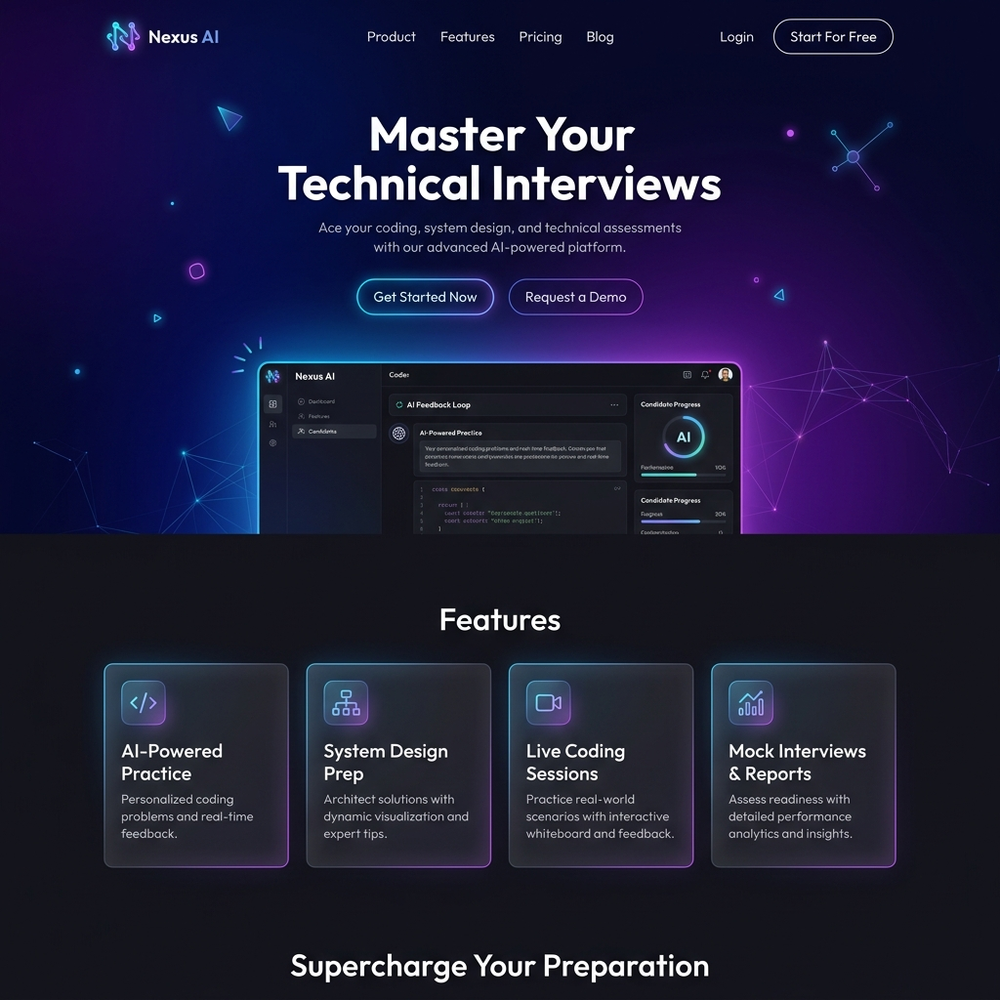
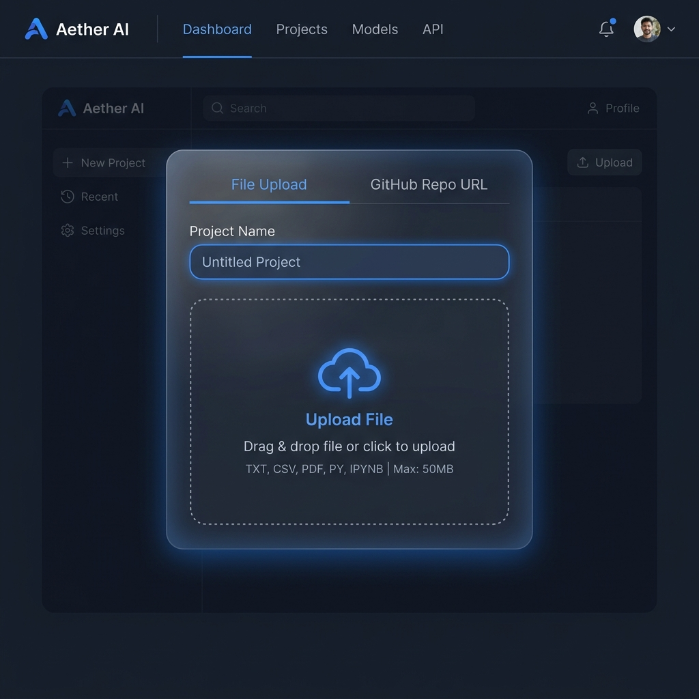
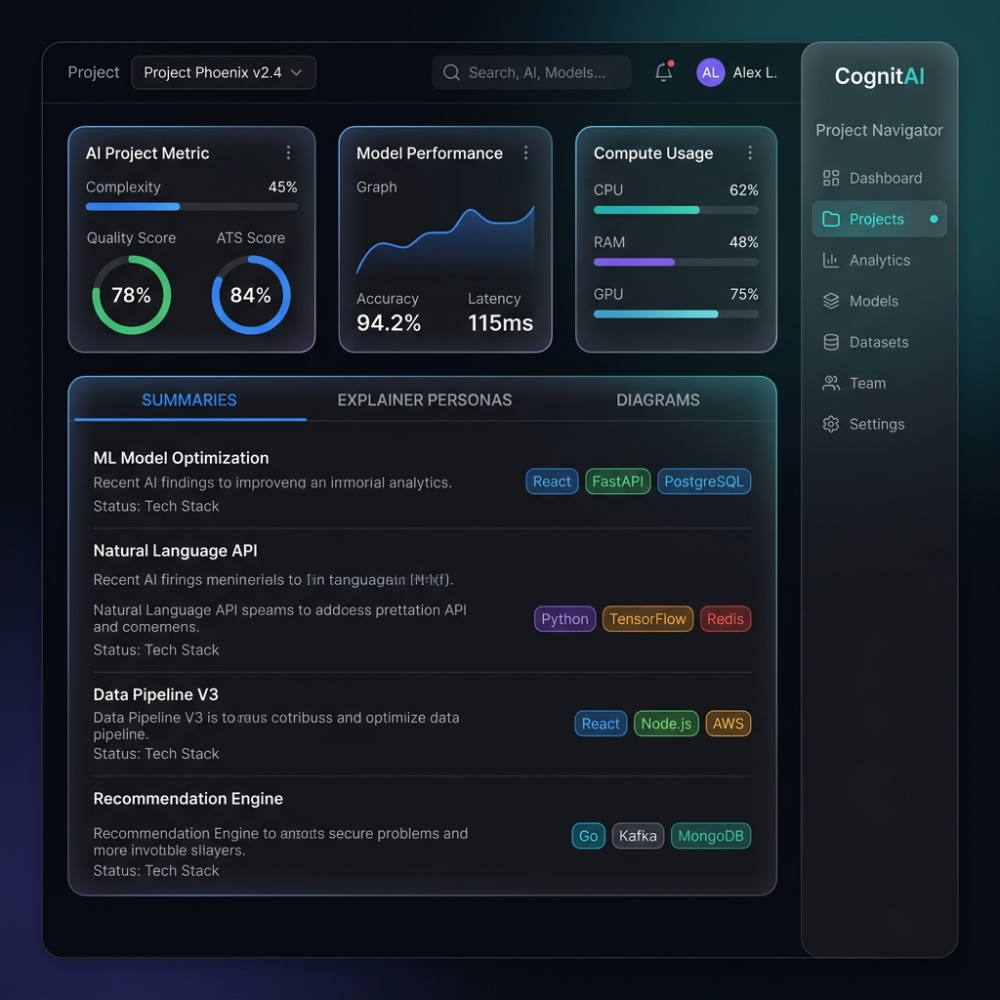
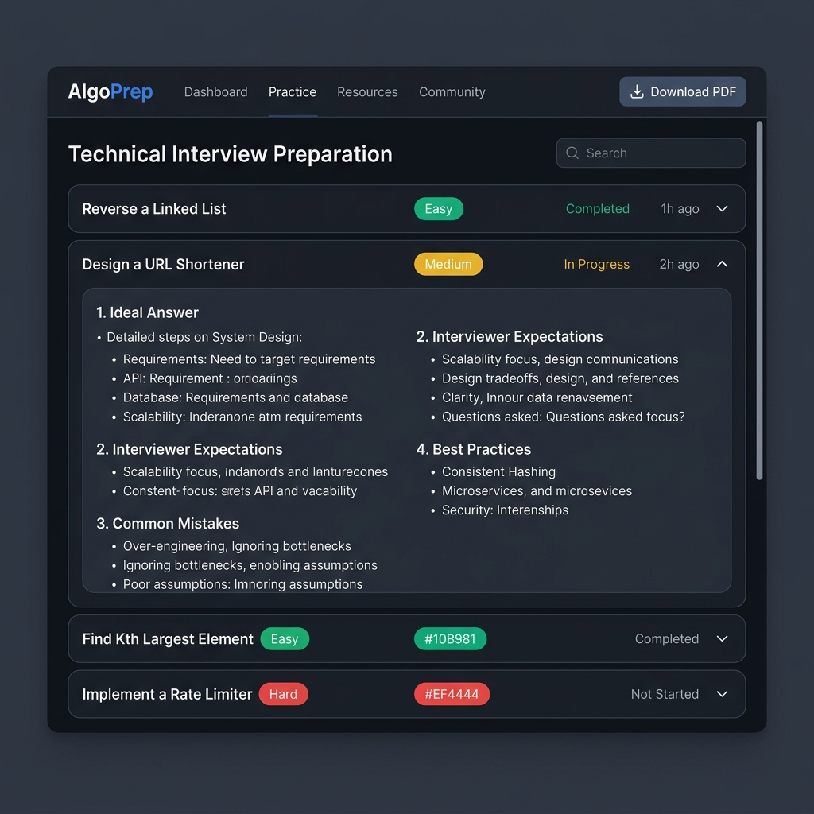
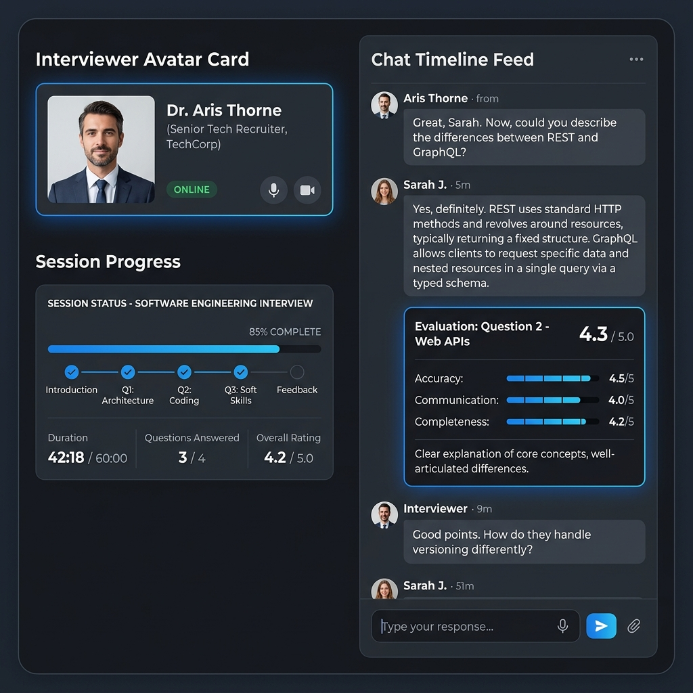
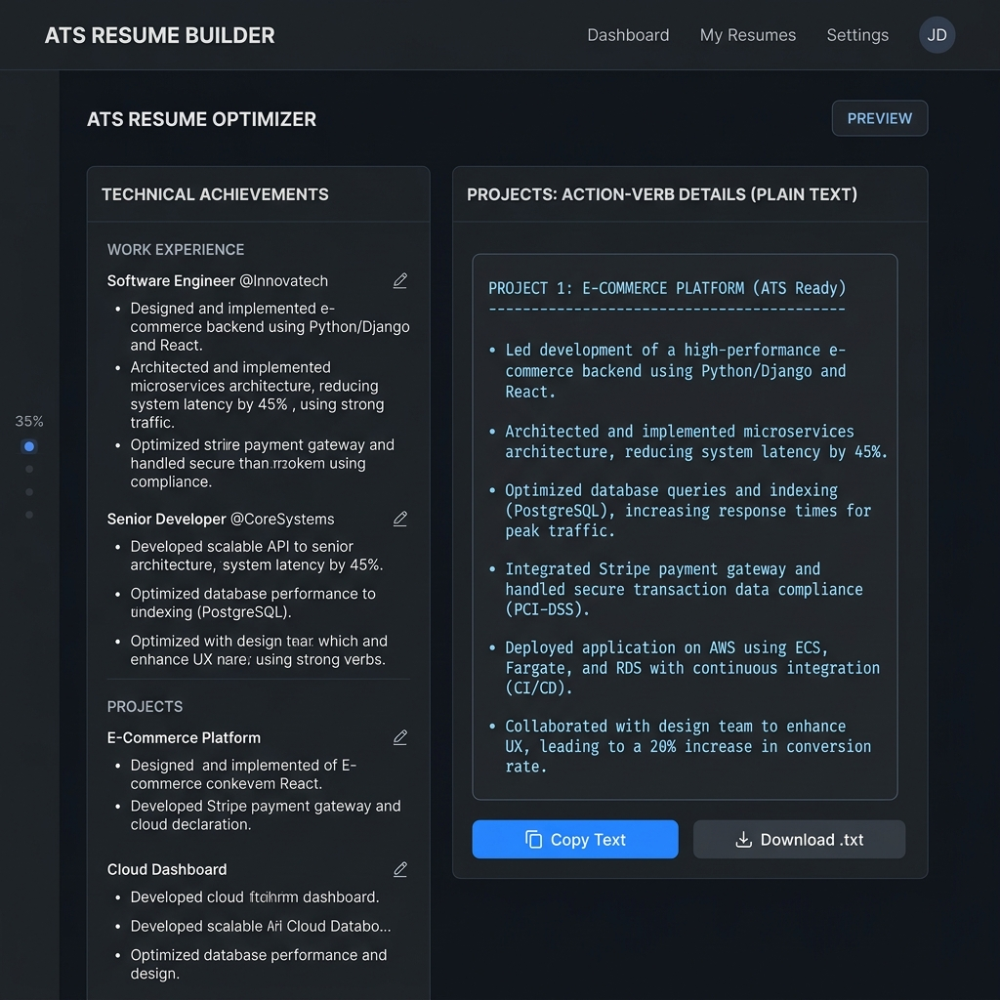

# AI Project Interview Generator & Codebase Analyzer

An AI-powered, full-stack platform designed to analyze complete repositories (ZIP uploads or remote GitHub links), map codebases, generate project-specific technical interview materials, explain codebase elements for multiple personas, design resume entries, and host interactive mock interview sessions with real-time scoring.

---

## 🚀 Key Features

1. **Ingestion Layer**:
   - Dynamic ZIP file upload (Drag & Drop UI).
   - Remote GitHub Repository URL import (automatic ZIPball download and extraction).

2. **Repository Intelligence Analyzer**:
   - Scans directory structures recursively, producing visual directory tree walks.
   - Computes project statistics (total files, file counts by language, Lines of Code).
   - Detects libraries, frameworks, SQL/NoSQL databases, cloud patterns, and ML stacks.
   - Measures project complexity dynamically from 1 to 100.

3. **AI Summarizer & Explainer**:
   - Custom summaries: *Beginner* (ELI5), *Technical* (Architecture flow), *Recruiter* (ATS-targeted impact), and *LinkedIn* (Social post builder).
   - Explainer Modes: *Fresher*, *Software Engineer*, *Team Lead*, and *Interview Pitch*.
   - Renders dynamic Mermaid.js diagrams: *System Architecture*, *Data Flows*, and *Component Relationships*.

4. **Interview prep & Q&A sheets**:
   - Generates 15 comprehensive project-specific Q&As covering Beginner (30%), Intermediate (40%), and Advanced (30%) difficulties.
   - Synthesizes interview criteria: *Ideal Answers*, *Recruiter Expectations*, *Common Pitfalls*, and *Best Coding Practices*.
   - Exports the technical prep sheet as a styled PDF guide.

5. **Live AI Mock Interview Simulator**:
   - Converse dynamically with Vince AI, a principal technical interviewer avatar.
   - Provides live score ratings (0-100) on each turn, measuring technical accuracy, communication structure, completeness, and confidence.
   - Generates a final score report card and summary transcript.

6. **ATS Resume Builder**:
   - Creates targeted project entries containing descriptions, core stacks, and quantified achievement bullets (focused on Generative AI, RAG, prompt engineering, etc.).
   - Text boxes optimized for copy-pasting, with raw `.txt` file exporters.

---

## 🖼️ Application Pages & Interface Mockups

### 1. Landing Page
*Welcome screen detailing platform capabilities and user authentication.*


### 2. File / ZIP Ingestion
*Generic uploader supporting code files, text PDFs, images, or project ZIPs.*


### 3. Codebase Analysis Dashboard
*Detailed codebase metrics dashboard presenting quality score, ATS scores, folder tree views, and Mermaid-rendered architecture flows.*


### 4. Technical Prep Sheet & Q&A
*Categorized list of generated interview questions showing ideal responses, expectations, pitfalls, and best practices.*


### 5. Mock Interview Chat Simulator
*Interactive conversational thread with Vince AI technically evaluating answers in real-time with comprehensive grading feedback.*


### 6. ATS Resume Bullet Builder
*Targeted quantified accomplishments ready for copy-pasting or text file export.*


---

## 🛠️ Technology Stack

* **Frontend**: React (Vite SPA), custom CSS (Glassmorphism, Dark/Light modes, Transitions), Mermaid.js
* **Backend**: Python 3.14+, FastAPI (REST endpoints), SQLAlchemy ORM, Uvicorn, ReportLab (PDF)
* **Database**: SQLite (default developer database) / PostgreSQL (production-ready)
* **AI Core**: Google Gemini 1.5/2.5 Flash, Prompt Engineering, structured JSON responses

---

## 📂 Codebase Folder Structure

```text
AI Project Interview Generator/
│
├── backend/
│   ├── app/
│   │   ├── ai/
│   │   │   ├── gemini_client.py  # Connects to Gemini API & provides mocks
│   │   │   └── prompts.py        # System instructions and JSON schemas
│   │   │
│   │   ├── analyzer/
│   │   │   ├── code_parser.py    # Walks code directory trees, LOC compiler
│   │   │   ├── repo_downloader.py# Fetches Github URLs & extracts uploads
│   │   │   └── tech_detector.py  # Techstack and complexity scorer
│   │   │
│   │   ├── routers/
│   │   │   ├── auth.py           # Register, login, profiles endpoints
│   │   │   ├── interviews.py     # Questions and PDF generator routes
│   │   │   ├── mock.py           # Chats simulator and evaluation routes
│   │   │   ├── projects.py       # ZIP upload, Github imports, and listing
│   │   │   └── resume.py         # Resume building and text exporters
│   │   │
│   │   ├── config.py             # Settings configurations, dotenv loading
│   │   ├── database.py           # SQLAlchemy sessions, database configs
│   │   ├── models.py             # Declarative database tables
│   │   ├── schemas.py            # Pydantic schemas validation
│   │   └── main.py               # FastAPI router mount & CORS middleware
│   │
│   ├── requirements.txt          # Python packages
│   └── run.py                    # Server launcher script
│
└── frontend/
    ├── src/
    │   ├── components/
    │   │   ├── MermaidViewer.jsx # Renders SVG flowcharts from Mermaid code
    │   │   ├── Navbar.jsx        # Navigation controls & theme toggles
    │   │   └── ScoreRing.jsx     # Animated circular score graphs
    │   │
    │   ├── context/
    │   │   ├── AuthContext.jsx   # Manages JWT tokens and profile states
    │   │   └── ThemeContext.jsx  # Toggles data-theme (light/dark) values
    │   │
    │   ├── pages/
    │   │   ├── Dashboard.jsx     # Stats, file tree, summaries, diagrams
    │   │   ├── InterviewQuestions.jsx # Collapsible Q&A cards & PDF export
    │   │   ├── LandingPage.jsx   # CTAs, features list, auth forms
    │   │   ├── MockInterview.jsx # Interviewer chat console & scorecard
    │   │   ├── ResumeGenerator.jsx# ATS Achievements list & text clipboard
    │   │   └── UploadProject.jsx # File upload drops and link inputs
    │   │
    │   ├── styles/
    │   │   ├── dashboard.css     # Dashboards, trees, and tab controls
    │   │   ├── global.css        # Theme variables, layouts, and animations
    │   │   ├── landing.css       # Glow blobs, hero text, and login forms
    │   │   └── mock.css          # Split consoles, chat bubbles, and scoring
    │   │
    │   ├── App.jsx               # SPA router mapping & protected guards
    │   └── main.jsx              # React DOM mounting
    │
    ├── package.json              # NPM dependencies
    └── vite.config.js            # Vite configurations
```
